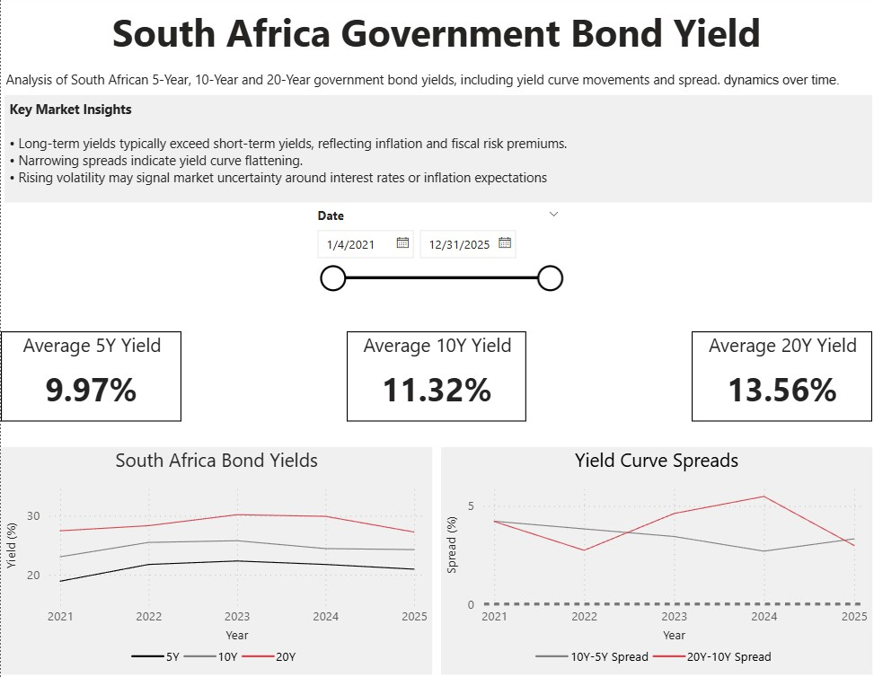

# South African Government Bond Yield Curve Dashboard

This project analyzes South African government bond yields (5Y, 10Y, 20Y) and visualizes yield curve dynamics using Python and Power BI.

## Dashboard Preview

## Key Features
- Interactive date filtering
- Yield curve trend analysis
- Yield spread monitoring (10Y-5Y and 20Y-10Y)
- Key market insights panel

## Tools Used
- Python (Pandas, Matplotlib)
- Power BI
- Financial time series analysis

## Project Components

### Data
South African government bond yields.

### Python Analysis
Data cleaning, spread calculations, and yield curve preparation.

### Power BI Dashboard
Interactive dashboard showing:
- Yield curve movements
- Yield spreads (10Y–5Y and 20Y–10Y)
- Average yields across maturities
- Date filtering for analysis

## Key Insights
- Long-term yields typically exceed short-term yields.
- Yield spreads help identify curve steepening or flattening.
- Changes in spreads may indicate macroeconomic expectations.
